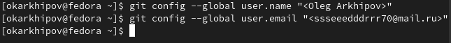
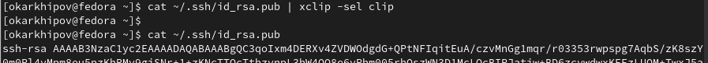
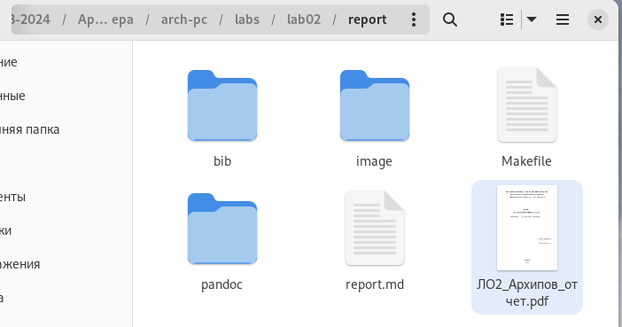

---
## Front matter
title: "РОССИЙСКИЙ УНИВЕРСИТЕТ ДРУЖБЫ НАРОДОВ"
subtitle: "Факультет физико-математических и естественных наук
Кафедра прикладной информатики и теории вероятностей"
author: "Архипов Олег Константинович"

## Generic otions
lang: ru-RU
toc-title: "Содержание"

## Bibliography
bibliography: bib/cite.bib
csl: pandoc/csl/gost-r-7-0-5-2008-numeric.csl

## Pdf output format
toc: true # Table of contents
toc-depth: 2
lof: true # List of figures
fontsize: 12pt
linestretch: 1.5
papersize: a4
documentclass: scrreprt
## I18n polyglossia
polyglossia-lang:
  name: russian
  options:
	- spelling=modern
	- babelshorthands=true
polyglossia-otherlangs:
  name: english
## I18n babel
babel-lang: russian
babel-otherlangs: english
## Fonts
mainfont: PT Serif
romanfont: PT Serif
sansfont: PT Sans
monofont: PT Mono
mainfontoptions: Ligatures=TeX
romanfontoptions: Ligatures=TeX
sansfontoptions: Ligatures=TeX,Scale=MatchLowercase
monofontoptions: Scale=MatchLowercase,Scale=0.9
## Biblatex
biblatex: true
biblio-style: "gost-numeric"
biblatexoptions:
  - parentracker=true
  - backend=biber
  - hyperref=auto
  - language=auto
  - autolang=other*
  - citestyle=gost-numeric
## Pandoc-crossref LaTeX customization
figureTitle: "Рис."
tableTitle: "Таблица"
listingTitle: "Листинг"
lofTitle: "Список иллюстраций"
lotTitle: "Список таблиц"
lolTitle: "Листинги"
## Misc options
indent: true
header-includes:
  - \usepackage{indentfirst}
  - \usepackage{float} # keep figures where there are in the text
  - \floatplacement{figure}{H} # keep figures where there are in the text
---

# Цель работы

Изучить VCS , алгоритм создания репозитория и научиться работать с системой git.

# Выполнение лабораторной работы

Создание предварительной конфигурации git (рис. @fig:001).

{#fig:001 width=100%}

Настраиваю utf-8 в выводе сообщений git, задаю имя начальной ветки и параметры autocrlf и safecrlf (рис. @fig:002).

{#fig:002 width=100%}

Генерирую приватный и открытый ключи (рис. @fig:003).

{#fig:003 width=100%}

Копирую ключи (рис. @fig:004).

{#fig:004 width=100%}

Создаю директорию для предмета (рис. @fig:005).

{#fig:005 width=100%}

Создаю репозитарий (рис. @fig:006).

{#fig:006 width=100%}

Перехожу в созданную папку (рис. @fig:007).

{#fig:007 width=100%}

Клонирую созданный репозиторий (рис. @fig:008).

{#fig:008 width=100%}

Перехожу в папку arch-pc , удаляю файл package и создаю каталоги (рис. @fig:009).

{#fig:009 width=100%}

На двух следующих рисунках ввожу команды для отправки на сервер.

{#fig:010 width=100%}

{#fig:011 width=100%}

# Самостоятельная работа

Перемещаю ЛР в указанную папку (рис. @fig:012).

{#fig:012 width=100%}

Перемещаю предыдущую ЛР в указанную папку (рис. @fig:013).

{#fig:013 width=100%}

Перемещаюсь в директорию arch-pc и отправляю изменения в ЦР командами get add , get commit –am , get push на рис.14-16.

{#fig:014 width=100%}

{#fig:015 width=100%}

{#fig:016 width=100%}

На рис.17-18 проверяю изменения.

{#fig:017 width=100%}

{#fig:018 width=100%}

# Выводы

Был создан репозитарий, усвоены основные команды и порядок работы с системой git.

::: {#refs}
:::
