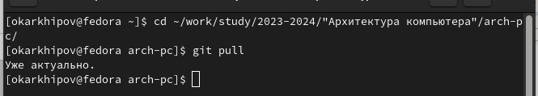
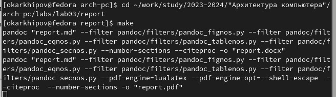
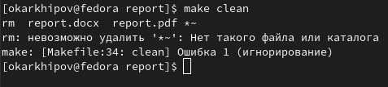
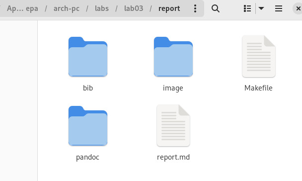
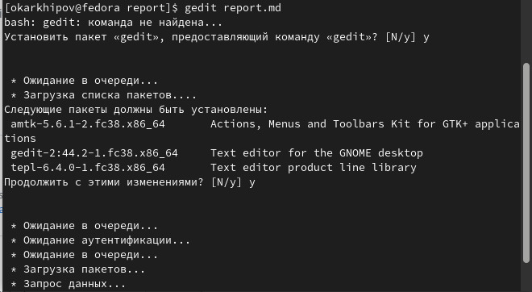
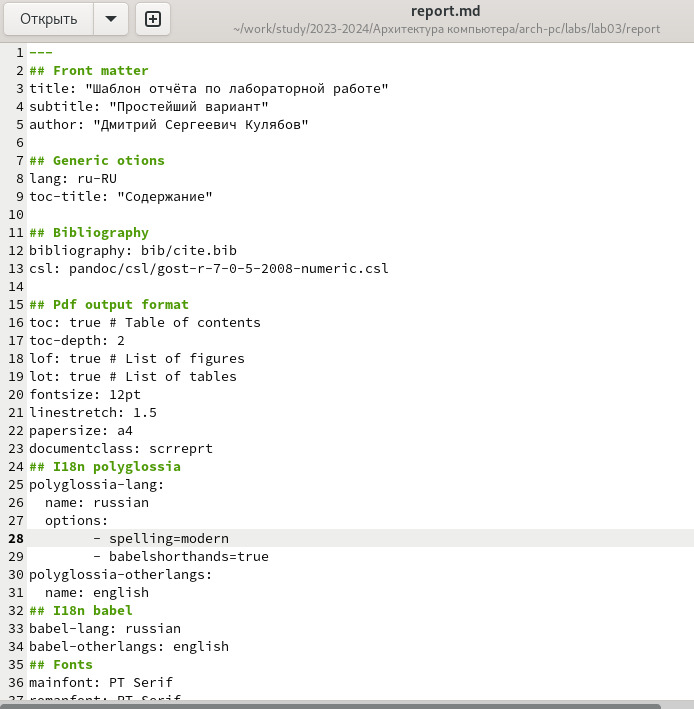
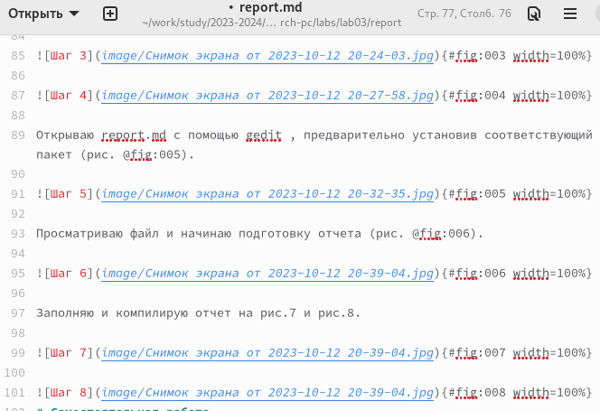
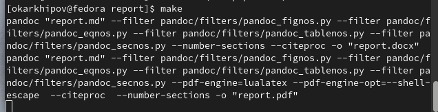

---
## Front matter
title: "РОССИЙСКИЙ УНИВЕРСИТЕТ ДРУЖБЫ НАРОДОВ"
subtitle: "Факультет физико-математических и естественных наук
Кафедра прикладной информатики и теории вероятностей"

author: "Архипов Олег Константинович"

## Generic otions
lang: ru-RU
toc-title: "Содержание"

## Bibliography
bibliography: bib/cite.bib
csl: pandoc/csl/gost-r-7-0-5-2008-numeric.csl

## Pdf output format
toc: true # Table of contents
toc-depth: 2
lof: true # List of figures
fontsize: 12pt
linestretch: 1.5
papersize: a4
documentclass: scrreprt
## I18n polyglossia
polyglossia-lang:
  name: russian
  options:
	- spelling=modern
	- babelshorthands=true
polyglossia-otherlangs:
  name: english
## I18n babel
babel-lang: russian
babel-otherlangs: english
## Fonts
mainfont: PT Serif
romanfont: PT Serif
sansfont: PT Sans
monofont: PT Mono
mainfontoptions: Ligatures=TeX
romanfontoptions: Ligatures=TeX
sansfontoptions: Ligatures=TeX,Scale=MatchLowercase
monofontoptions: Scale=MatchLowercase,Scale=0.9
## Biblatex
biblatex: true
biblio-style: "gost-numeric"
biblatexoptions:
  - parentracker=true
  - backend=biber
  - hyperref=auto
  - language=auto
  - autolang=other*
  - citestyle=gost-numeric
## Pandoc-crossref LaTeX customization
figureTitle: "Рис."
tableTitle: "Таблица"
listingTitle: "Листинг"
lofTitle: "Список иллюстраций"
lotTitle: "Список таблиц"
lolTitle: "Листинги"
## Misc options
indent: true
header-includes:
  - \usepackage{indentfirst}
  - \usepackage{float} # keep figures where there are in the text
  - \floatplacement{figure}{H} # keep figures where there are in the text
---

# Цель работы

Изучить языка разметки Markdown и научиться с его помощью оформлять отчеты.

# Выполнение лабораторной работы

Перехожу в каталог курса и проверяю изменения (рис. @fig:001).

{#fig:001 width=100%}

Перехожу в каталог шаблона ЛР №3 и компилирую шаблон при помощи make (рис. @fig:002).

{#fig:002 width=100%}

Удаляю report.docx и report.pdf при помощи make clean на рис.3 и проверяю результат на рис.4.

{#fig:003 width=100%}

{#fig:004 width=100%}

Открываю report.md с помощью gedit , предварительно установив соответствующий пакет (рис. @fig:005).

{#fig:005 width=100%}

Просматриваю файл и начинаю подготовку отчета (рис. @fig:006).

{#fig:006 width=100%}

Заполняю и компилирую отчет на рис.7 и рис.8.

{#fig:007 width=100%}

{#fig:008 width=100%}

# Самостоятельная работа
Теперь я загружу обновления на Github , а затем созднам отчеты формата Markdown для первой и второй лабораторных.

# Выводы
Были освоены основы Markdown.

::: {#refs}
:::
