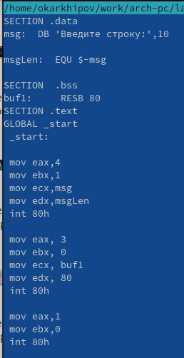

---
## Front matter
title: "РОССИЙСКИЙ УНИВЕРСИТЕТ ДРУЖБЫ НАРОДОВ"
subtitle: "Факультет физико-математических и естественных наук
Кафедра прикладной информатики и теории вероятностей"
author: "Архипов Олег Константинович"

## Generic otions
lang: ru-RU
toc-title: "Содержание"

## Bibliography
bibliography: bib/cite.bib
csl: pandoc/csl/gost-r-7-0-5-2008-numeric.csl

## Pdf output format
toc: true # Table of contents
toc-depth: 2
lof: true # List of figures
fontsize: 12pt
linestretch: 1.5
papersize: a4
documentclass: scrreprt
## I18n polyglossia
polyglossia-lang:
  name: russian
  options:
	- spelling=modern
	- babelshorthands=true
polyglossia-otherlangs:
  name: english
## I18n babel
babel-lang: russian
babel-otherlangs: english
## Fonts
mainfont: PT Serif
romanfont: PT Serif
sansfont: PT Sans
monofont: PT Mono
mainfontoptions: Ligatures=TeX
romanfontoptions: Ligatures=TeX
sansfontoptions: Ligatures=TeX,Scale=MatchLowercase
monofontoptions: Scale=MatchLowercase,Scale=0.9
## Biblatex
biblatex: true
biblio-style: "gost-numeric"
biblatexoptions:
  - parentracker=true
  - backend=biber
  - hyperref=auto
  - language=auto
  - autolang=other*
  - citestyle=gost-numeric
## Pandoc-crossref LaTeX customization
figureTitle: "Рис."
tableTitle: "Таблица"
listingTitle: "Листинг"
lofTitle: "Список иллюстраций"
lotTitle: "Список таблиц"
lolTitle: "Листинги"
## Misc options
indent: true
header-includes:
  - \usepackage{indentfirst}
  - \usepackage{float} # keep figures where there are in the text
  - \floatplacement{figure}{H} # keep figures where there are in the text
---

# Цель работы

Приобретение практических навыков работы в Midnight Commander. Освоение инструкций языка ассемблера mov и int.

# Выполнение лабораторной работы

## Операции в mc и исполнение созданного файла
Открываю Midnight Commander (рис. @fig:001).

{#fig:001 width=100%}

Перехожу в каталог ~/work/arch-pc при помощи клавиатуры, затем создаю папку lab05 при помощи клавиши F7 и перехожу в созданный каталог, что демонстрируется на рис.2-4.

{#fig:002 width=100%}

{#fig:003 width=100%}

{#fig:004 width=100%}

Создаю файл lab5-1.asm при помощи команды touch (рис. @fig:005).

{#fig:005 width=100%}

Открываю файл lab5-1.asm для редактирования (рис. @fig:006-@fig:007).

{#fig:006 width=100%}

{#fig:007 width=100%}

Ввожу текст программы из листинга в задании ЛР и сохраняю изменения при помощи клавиш CTRL+X , а затем Y и ENTER (выход и сохранение)(рис. @fig:008).

{#fig:008 width=50%}

Далее открываю файл снова при помощи клавиши F3 и убеждаюсь, что текст сохранился (рис. @fig:009).

{#fig:009 width=50%}

Транслирую lab5-1.asm в объектный файл, компаную и запускаю его, после чего ввожу свои ФИО (рис. @fig:010-@fig:011).

{#fig:010 width=100%}

{#fig:011 width=100%}

## Внешний файл

Скачиваю файл in_out.asm со страницы курса в ТУИС (рис. @fig:012).

{#fig:012 width=30%}

Открываю в соседних панелях mc папки с файлами in_out.asm и lab5-1.asm (рис. @fig:013).

{#fig:013 width=100%}

Копирую in_out.asm из папки Загрузки в директорию ~/work/arch-pc/lab05 при помощи клавиши F5 (рис. @fig:014).

{#fig:014 width=70%}

Также при помощи F5 создаю копию lab5-1.asm с именем lab5-2.asm , прописывая путь (рис. @fig:015).

{#fig:015 width=70%}

Исправляю текст программы в файле lab5-2.asm в соответствии с листингом из текста ЛР (рис. @fig:016).

{#fig:016 width=100%}

Транслирую, компаную и исполняю новый файл, после чего ввожу туда свои ФИО (рис. @fig:017-@fig:018).

{#fig:017 width=100%}

{#fig:018 width=100%}

Далее заменяю в lab5-2.asm sprintLF на sprint и также транслирую, компаную, исполняю (рис. @fig:019-@fig:020).

{#fig:019 width=100%}

{#fig:020 width=100%}

Как можно выдеть, сравнив изображения 18 и 20, разница между программой с sprintLF и sprint в том, что первая переходит на следующую строку при выводе, а вторая выводит сообщение в одной строке.

# Самостоятельная работа

Копирую lab5-1.asm с именем lab5-12.asm (рис. @fig:021).

{#fig:021 width=70%}

Вношу изменения в lab5-12.asm так, чтобы алгоритм помимо ранее описанных действий (вывод приглашения типа "Введите строку:" и ввод строки с клавиатуры) также выводил введенную строку на экран (был добавлен третий блок код программы, на рисунке он прокомментирован)(рис. @fig:022).

{#fig:022 width=70%}

Создаю исполняемую программу (рис. @fig:023).

{#fig:023 width=100%}

Ввожу свою фамилию и нажимаю ENTER , получаю второй раз свою фамилию (рис. @fig:024-@fig:025).

{#fig:024 width=100%}

{#fig:025 width=100%}

Затем возвращаюсь в каталог ~/work/arch-pc/lab05 и создаю копию файла lab5-2.asm с именем lab5-22.asm при помощи клавиши F5 (рис. @fig:026).

{#fig:026 width=70%}

Изменяю текст программы, добавляя две предпоследние строки, как на рисунке 3.7.

{#fig:027 width=70%}

После этого ввожу последовательность команд для создания исполняемого файла (рис. @fig:028).

{#fig:028 width=100%}

Из-за того что я оставил sprint , фамилия вводится без переноса на следующую строку (рис. @fig:029).

{#fig:029 width=100%}

После нажатия клавиши ENTER получаю снова свою фамилию (рис. @fig:030).

{#fig:030 width=100%}

Теперь при помощи команды make скомпилирую ЛР, скопирую созданные файлы asm в каталог ~/work/study/2023-2024/"Архитектура компьютера"/arch-pc/labs/lab05 , а затем загружу все на Github .

# Выводы

Были освоены инструкции mov и int языка NASM , а также расширены знания о mc .

::: {#refs}
:::
