---
## Front matter
title: "РОССИЙСКИЙ УНИВЕРСИТЕТ ДРУЖБЫ НАРОДОВ"
subtitle: "Факультет физико-математических и естественных наук
Кафедра прикладной информатики и теории вероятностей"
author: "Архипов Олег Константинович"

## Generic otions
lang: ru-RU
toc-title: "Содержание"

## Bibliography
bibliography: bib/cite.bib
csl: pandoc/csl/gost-r-7-0-5-2008-numeric.csl

## Pdf output format
toc: true # Table of contents
toc-depth: 2
lof: true # List of figures
fontsize: 12pt
linestretch: 1.5
papersize: a4
documentclass: scrreprt
## I18n polyglossia
polyglossia-lang:
  name: russian
  options:
	- spelling=modern
	- babelshorthands=true
polyglossia-otherlangs:
  name: english
## I18n babel
babel-lang: russian
babel-otherlangs: english
## Fonts
mainfont: PT Serif
romanfont: PT Serif
sansfont: PT Sans
monofont: PT Mono
mainfontoptions: Ligatures=TeX
romanfontoptions: Ligatures=TeX
sansfontoptions: Ligatures=TeX,Scale=MatchLowercase
monofontoptions: Scale=MatchLowercase,Scale=0.9
## Biblatex
biblatex: true
biblio-style: "gost-numeric"
biblatexoptions:
  - parentracker=true
  - backend=biber
  - hyperref=auto
  - language=auto
  - autolang=other*
  - citestyle=gost-numeric
## Pandoc-crossref LaTeX customization
figureTitle: "Рис."
tableTitle: "Таблица"
listingTitle: "Листинг"
lofTitle: "Список иллюстраций"
lotTitle: "Список таблиц"
lolTitle: "Листинги"
## Misc options
indent: true
header-includes:
  - \usepackage{indentfirst}
  - \usepackage{float} # keep figures where there are in the text
  - \floatplacement{figure}{H} # keep figures where there are in the text
---

# Цель работы

Освоение арифметических инструкций языка ассемблера NASM .

# Выполнение лабораторной работы

## Символьные и численные данные в NASM

Создаю каталог для программ ЛР №6, перехожу в него и создаю там файл lab6-1.asm (рис. @fig:001).

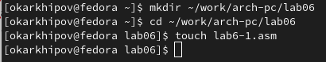{#fig:001 width=100%}

Копирую файл in_out.asm в новую директорию ~/work/arch-pc/lab06 (рис. @fig:002).

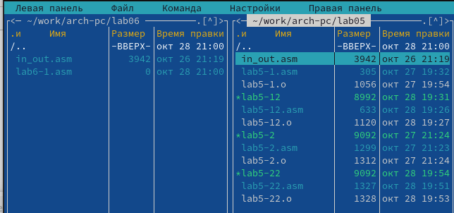{#fig:002 width=100%}

Прописываю в файле lab6-1.asm текст программы, которая запишет в регистр eax символ 6, в регистр ebx - символ 4, далее сложит эти два значения и выведет результат (для последнего запишет значение регистра eax в переменную buf1 (в квадратных скобках, т.к. это переменная) и затем в регистр eax - адрес переменной buf1 (адрес - без скобок) (рис. @fig:003).

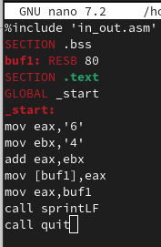{#fig:003 width=50%}

Cоздаю и запускаю исполняемый файл и действительно получаю на выходе символ j , т.к. складываются двоичные представления кодов символов 6 и 4 , после чего выводится символ, соответствующий этому суммарному коду (рис. @fig:004).

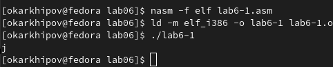{#fig:004 width=100%}

Изменяю mov eax,'6' и mov ebx,'4' на mov eax,6 и mov ebx,4 в исходном коде (рис. @fig:005).

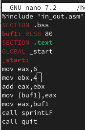{#fig:005 width=50%}

Снова исполняю обновленный файл и поучаю символ с кодом 10 , или LF т.е. символ перевода строки, отображаться он не будет (если не учитывать пропущенную строку) (рис. @fig:006).

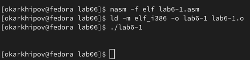{#fig:006 width=100%}

Создаю новый файл lab6-2.asm в той же директории (рис. @fig:007).

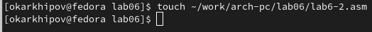{#fig:007 width=100%}

Ввожу следующую программу (рис. @fig:008).

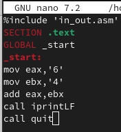{#fig:008 width=50%}

Компилирую исполняемый файл для lab6-2.asm и запускаю его, получаю число 106, которое является суммой кодов исходных символов (рис. @fig:009).

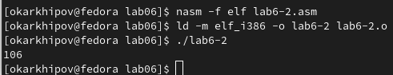{#fig:009 width=100%} 

Заменяю в lab6-2.asm mov eax,'6' и mov ebx,'4' на mov eax,6 и mov ebx,4 как и в предыдущем файле lab6-1.asm (рис. @fig:010).

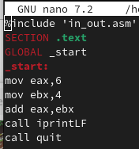{#fig:010 width=50%} 

Создаю объектный и исполняемый файлы программы и запускаю последний, получаю число 10 (рис. @fig:011).

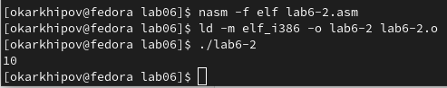{#fig:011 width=100%} 

Заменяю функцию iprintLF на iprint и снова создаю исполняемый файл, после чего запускаю его, получаю то же число 10, без символа перевода строки, что и характеризует отличие функций iprintLF на iprint (рис. @fig:012-@fig:013).

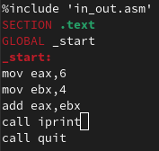{#fig:012 width=50%}

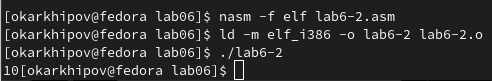{#fig:013 width=100%}

## Арифметические операции в NASM

Создаю файл lab6-3.asm в каталоге ~/work/arch-pc/lab06 (рис. @fig:014).

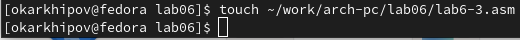{#fig:014 width=80%}

Ввожу текст программы в файл lab6-3.asm (рис. @fig:015).

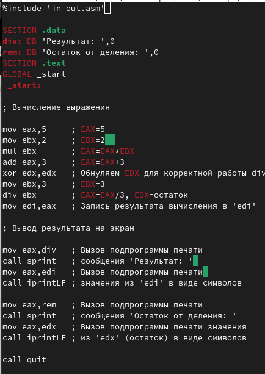{#fig:015 width=100%}

Создаю файлы: объектный lab6-3.o и исполняемый lab6-3 и запускаю программу, получаю 4 и 1 в остатке, как и должно быть (рис. @fig:016).

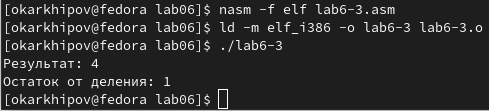{#fig:016 width=100%}

Изменяю текст программы для вычисления выражения $$ f(x)=(4*6+2)/5 $$ (можно сравнить рис. @fig:017 и рис. @fig:015).

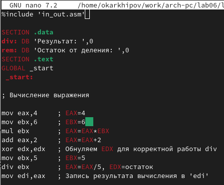{#fig:017 width=100%}

Проверяю результат работы программы после внесенных изменений (рис. @fig:018).

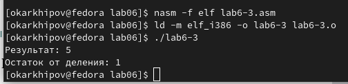{#fig:018 width=100%}

Для следующего задания по вычислению варианта задания по номеру студенческого билета создаю файл variant.asm в каталоге ~/work/arch-pc/lab06 (рис. @fig:019).

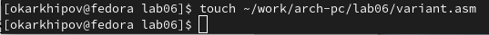{#fig:019 width=100%}

Ввожу текст программы, которая запросит номер студ. билета, затем вычислит вариант по формуле $(S_{n} \mod 20)+1$, т.е. остаток от деления № билета на 20 и ещё плюс 1, после чего выведет ответ на экран (рис. @fig:020). 

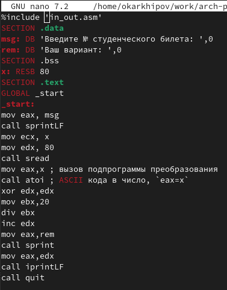{#fig:020 width=100%}

Создаю исполняемый файл и запускаю его (рис. @fig:021), ввожу номер билета (рис. @fig:022) и получаю в ответе 4, что верно (рис. @fig:023).

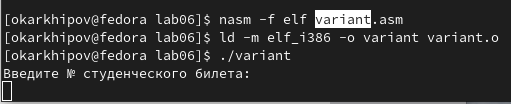{#fig:021 width=100%}

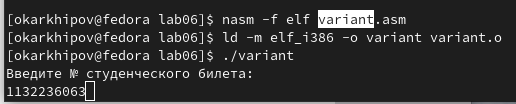{#fig:022 width=100%}

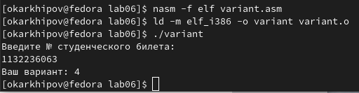{#fig:023 width=100%}

1) В этой программе за вывод на экран сообщения ‘Ваш вариант:’ отвечают строки:
``` NASM
rem: DB 'Ваш вариант: ',0
.
.
.
mov eax,rem
call sprint
```
2) Строки:
``` NASM
mov ecx, x
mov edx, 80
call sread
```
отвечают за помещение адреса x , где x - вводимая строка (в данном случае номер билета) в регистр ecx , а в регистр edx - максимальную длину этой строки, call sread - вызов подпрограммы внешнего файла in_out.asm , отвечающей за ввод сообщения с клавиатуры.

3) Инструкция “call atoi” используется для вызова функции преобразования ASCII - кода символа в целое число, после чего записывает результат в регистр eax .

4) За вычисление варианта отвечают команды: "xor edx,edx" - обнуление регистра edx , "mov ebx,20" - присвоение регистру ebx значения 20, "div ebx" - деление на 20 (значение регистра ebx) значения соответствующего регистра eax , в edx - остаток, "inc edx" - увеличение остатка, записанного в регистр edx на 1.

5) Как уже упоминалось выше остаток от деления при выполнении инструкции “div ebx” записывается в регистр edx .

6) Инструкция “inc edx” нужна для увеличения значения в регистре edx на 1.

7) За вывод на экран результата вычислений отвечают команды "mov eax,edx" и "call iprintLF".

# Самостоятельная работа

Мой номер варианта 4, значит беру функцию вида $$ f(x)=(4/3)*(x-1)+5, $$ где $x_1=4, x_2=10$.

Создаю в директории ~/work/arch-pc/lab06 файл solution.asm (рис. @fig:024).

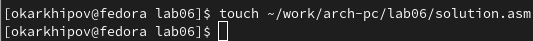{#fig:024 width=100%}

Далее прописываю код. Он достаточно подробно описан на рис. @fig:025.

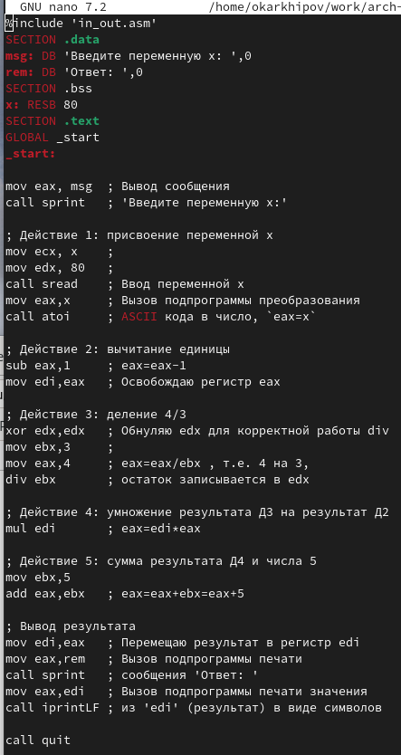{#fig:025 width=70%}

Создаю исполняемый файл и запускаю его, в качестве переменной ввожу 4, получаю ответ 8. Это результат без учета остатка в операции деления (рис. @fig:026).

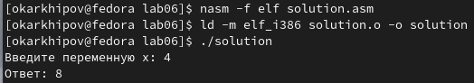{#fig:026 width=100%}

Запускаю программу еще раз с переменной 10, чтобы удостовериться в правильности работы программы, результат верный (рис. @fig:027).

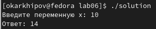{#fig:027 width=100%}

# Выводы

Были освоены особенности арифметических операций в ассемблере NASM.

# Список литературы{.unnumbered}

::: {#refs}
:::
