---
## Front matter
title: "РОССИЙСКИЙ УНИВЕРСИТЕТ ДРУЖБЫ НАРОДОВ"
subtitle: "Факультет физико-математических и естественных наук
Кафедра прикладной информатики и теории вероятностей"
author: "Архипов Олег Константинович"

## Generic otions
lang: ru-RU
toc-title: "Содержание"

## Bibliography
bibliography: bib/cite.bib
csl: pandoc/csl/gost-r-7-0-5-2008-numeric.csl

## Pdf output format
toc: true # Table of contents
toc-depth: 2
lof: true # List of figures
fontsize: 12pt
linestretch: 1.5
papersize: a4
documentclass: scrreprt
## I18n polyglossia
polyglossia-lang:
  name: russian
  options:
	- spelling=modern
	- babelshorthands=true
polyglossia-otherlangs:
  name: english
## I18n babel
babel-lang: russian
babel-otherlangs: english
## Fonts
mainfont: PT Serif
romanfont: PT Serif
sansfont: PT Sans
monofont: PT Mono
mainfontoptions: Ligatures=TeX
romanfontoptions: Ligatures=TeX
sansfontoptions: Ligatures=TeX,Scale=MatchLowercase
monofontoptions: Scale=MatchLowercase,Scale=0.9
## Biblatex
biblatex: true
biblio-style: "gost-numeric"
biblatexoptions:
  - parentracker=true
  - backend=biber
  - hyperref=auto
  - language=auto
  - autolang=other*
  - citestyle=gost-numeric
## Pandoc-crossref LaTeX customization
figureTitle: "Рис."
tableTitle: "Таблица"
listingTitle: "Листинг"
lofTitle: "Список иллюстраций"
lotTitle: "Список таблиц"
lolTitle: "Листинги"
## Misc options
indent: true
header-includes:
  - \usepackage{indentfirst}
  - \usepackage{float} # keep figures where there are in the text
  - \floatplacement{figure}{H} # keep figures where there are in the text
---

# Цель работы

Изучение команд условного и безусловного переходов. Приобретение навыков написания
программ с использованием переходов. Знакомство с назначением и структурой файла
листинга.

# Выполнение лабораторной работы

## Безусловный переход

Создаю каталог ~/work/arch-pc/lab07 , перехожу в него и создаю в нем файл lab7-1.asm (рис. @fig:001).

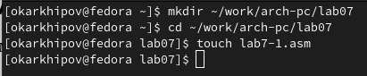{#fig:001 width=70%}

Как и в прошлые разы копирую в созданный каталог внешний файл in_out.asm , а затем при помощи команды gedit lab7-1.asm открываю файл в текстовом редакторе (рис. @fig:002).

{#fig:002 width=70%}

Вбиваю текст программы с применением инструкции jmp из первого листинга ЛР (рис. @fig:003).

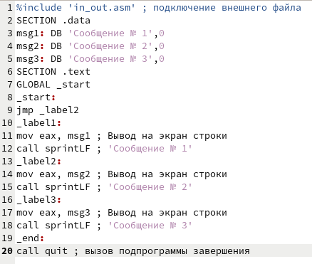{#fig:003 width=70%}

Создаю исполняемый файл для программы и запускаю его, получаю последовательность сообщений "2"->"3", т.к. после начала программы реализуется переход к label2 минуя label1 посредством команды ```NASM
jmp_label2``` (рис. @fig:003-@fig:004).

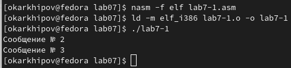{#fig:004 width=70%}

Изменяю программу так, чтобы она выводила сначала ‘Сообщение № 2’, потом ‘Сообщение № 1’ и завершала работу. Для этого в текст программы после вывода сообщения № 2 добавлю инструкцию jmp с меткой _label1 , а после вывода сообщения № 1 добавлю инструкцию jmp с меткой _end (рис. @fig:005).

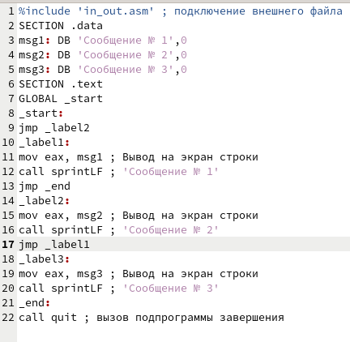{#fig:005 width=70%}

Создаю и запускаю исполняемый файл, выводится верная последовательность сообщений (рис. @fig:006).

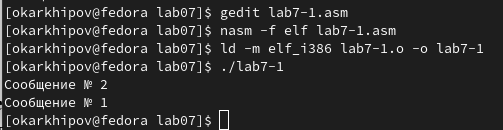{#fig:006 width=70%}

В начале программы изменяю инструкцию jmp _label2 на jmp _label3 , затем после вывода сообщения № 3 добавляю jmp _label2 , чтобы вывод програм-
мы был следующим ``` NASM
[okarkhipov@fedora lab07]$ ./lab7-1
Сообщение № 3
Сообщение № 2
Сообщение № 1
[okarkhipov@fedora lab07]$ ```

Получаю результат с изображений @fig:007 и @fig:008.

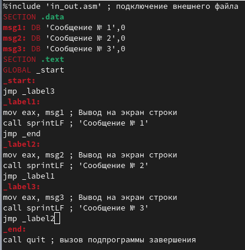{#fig:007 width=70%}

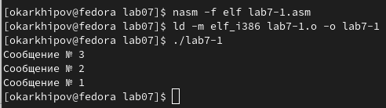{#fig:008 width=70%}

## Условный переход

Создаю файл lab7-2.asm (рис. @fig:009).

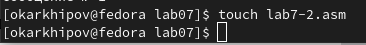{#fig:009 width=70%}

Ввожу из листинга ЛР программу, которая найдет наибольшее из трех целых чисел A, B, C (рис. @fig:010-#fig:011).

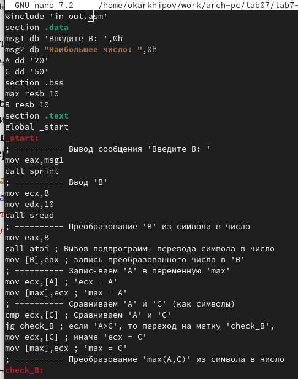{#fig:010 width=70%}

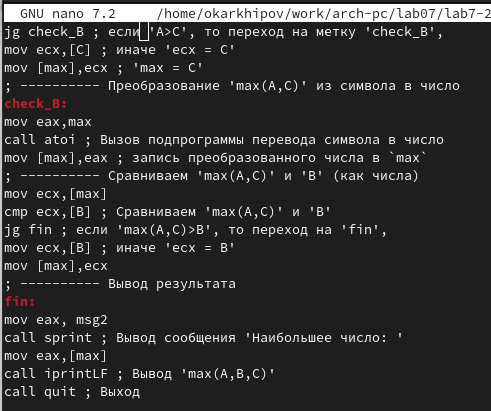{#fig:011 width=70%}

Создаю исполняемый файл (рис. #fig:012).

{#fig:012 width=70%}

Ввожу разные значения B: сначала 7 - наименьшее из трех чисел (рис. #fig:013), затем 51 - наибольшее (рис. #fig:014), 30 (рис. #fig:015) и 50, равное наибольшему (рис. #fig:016). Во всех случаях получаю верный результат.

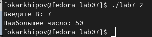{#fig:013 width=70%}

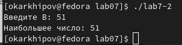{#fig:014 width=70%}

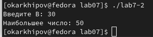{#fig:015 width=70%}

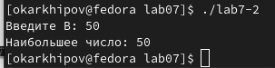{#fig:016 width=70%}

## Изучение структуры файлы листинга

Ввожу nasm -f elf -l lab7-2.lst lab7-2.asm для создания файла листинга lab7-2.lst (рис. @fig:016).

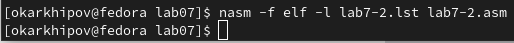{#fig:015 width=70%}

Открываю его в текстовом редакторе (рис. @fig:017).

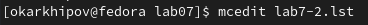{#fig:017 width=70%}

Рассмотрю, к примеру строки 28-30 файла листинга (отсчет строк без учета внешнего файла) (рис. @fig:018). Первая колонка, очевидно, обозначает номер строки, вторая адрес (смещение машинного кода от начала текущего сегмента), например 0000011C означает - адрес команды cmp ecx,[C] (в шестнадцатиричной системе счисления), аналогично для строк 29 и 30, 00000122 и 00000124 - адреса jg check_B и mov ecx,[C] соответственно. Далее во всех трех строках идут машинные коды (3B0D[39000000], 7F0C, 8B0D[39000000]), в которые ассемблируются соответствующие инструкции. Наконец, сами cmp ecx,[C] , jg check_B , mov ecx,[C] являются исходным текстом программы, первая инструкция сравнивает А и С, вторая в зависимости от результата сравнения переводит или не переводит программу на метку 'check_B', третья предполагает действия, в случае, если условие jg не выполнено. Каждая из этих инструкций прокомментирована в тексте программы (рис. @fig:018).

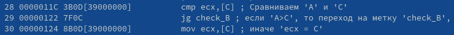{#fig:018 width=70%}

Снова открываю lab7-2.asm . В строке "mov ecx, [C] ; иначе 'ecx=C'" удаляю операнд [C] (рис. @fig:019).

![Удаляю операнд [C]](image/Снимок экрана от 2023-11-08 12-50-23.png){#fig:019 width=70%}

Выполняю трансляцию командой nasm -f elf -l lab7-2.lst lab7-2.asm , предварительно удалив старый файл листинга. Файл листинга создается, но без объектного файла (рис. @fig:020-@fig:021), вместо этого терминал выдаёт ошибку, т.к. теперь одна из инструкций записана некорректно.

{#fig:020 width=70%}

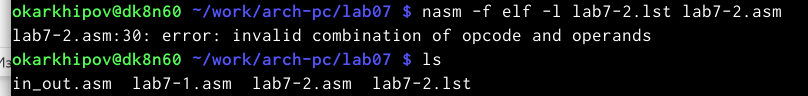{#fig:021 width=70%}

Открываю файл листинга, на месте измененной строки стоят звездочки и описание ошибки (рис. @fig:022).

![Удаляю операнд [C]](image/Снимок экрана от 2023-11-08 13-10-23.png){#fig:022 width=70%}

# Выводы

Здесь кратко описываются итоги проделанной работы.

# Список литературы{.unnumbered}

::: {#refs}
:::
