---
## Front matter
title: "РОССИЙСКИЙ УНИВЕРСИТЕТ ДРУЖБЫ НАРОДОВ"
subtitle: "Факультет физико-математических и естественных наук
Кафедра прикладной информатики и теории вероятностей"
author: "Архипов Олег Константинович"

## Generic otions
lang: ru-RU
toc-title: "Содержание"

## Bibliography
bibliography: bib/cite.bib
csl: pandoc/csl/gost-r-7-0-5-2008-numeric.csl

## Pdf output format
toc: true # Table of contents
toc-depth: 2
lof: true # List of figures
fontsize: 12pt
linestretch: 1.5
papersize: a4
documentclass: scrreprt
## I18n polyglossia
polyglossia-lang:
  name: russian
  options:
	- spelling=modern
	- babelshorthands=true
polyglossia-otherlangs:
  name: english
## I18n babel
babel-lang: russian
babel-otherlangs: english
## Fonts
mainfont: PT Serif
romanfont: PT Serif
sansfont: PT Sans
monofont: PT Mono
mainfontoptions: Ligatures=TeX
romanfontoptions: Ligatures=TeX
sansfontoptions: Ligatures=TeX,Scale=MatchLowercase
monofontoptions: Scale=MatchLowercase,Scale=0.9
## Biblatex
biblatex: true
biblio-style: "gost-numeric"
biblatexoptions:
  - parentracker=true
  - backend=biber
  - hyperref=auto
  - language=auto
  - autolang=other*
  - citestyle=gost-numeric
## Pandoc-crossref LaTeX customization
figureTitle: "Рис."
tableTitle: "Таблица"
listingTitle: "Листинг"
lofTitle: "Список иллюстраций"
lotTitle: "Список таблиц"
lolTitle: "Листинги"
## Misc options
indent: true
header-includes:
  - \usepackage{indentfirst}
  - \usepackage{float} # keep figures where there are in the text
  - \floatplacement{figure}{H} # keep figures where there are in the text
---

# Цель работы

Приобретение навыков написания программ с использованием циклов и обработкой
аргументов командной строки.

# Выполнение лабораторной работы

## Реализация циклов в NASM
Создаю каталог для программам лабораторной работы № 8, перехожу в него и создаю файл lab8-1.asm (рис. @fig:001).

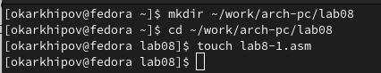{#fig:001 width=70%}

Изучаю программу, которая выводит значение регистра ecx, являющегося счетчиком для инструкции loop (рис. @fig:002).

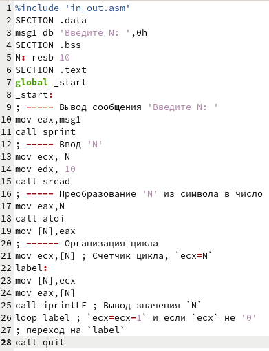{#fig:002 width=70%}

Создаю исполняемый файл и проверяю его работу для значения 10, однако программа работает не так, как задумывалось: она должна выводить значения от 9 до 0 (рис. @fig:003).

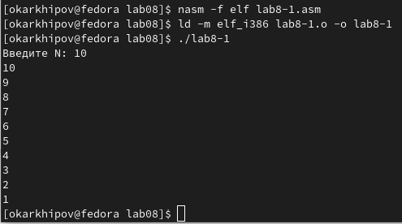{#fig:003 width=70%}

Изменяю текст программы, добавляя изменение значения регистра ecx в цикле (рис. @fig:004).

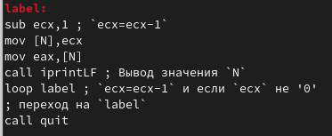{#fig:004 width=70%}

Еще раз проверяю работу программы, снова получаю неверный результат, т.к. теперь программа за 1 проход цикла дважды уменьшает значение 'ecx' на 1. Т.е. получаю первое значение 9, а далее каждый раз вычитается 2: 7, 5, 3, 1 (рис. @fig:005).

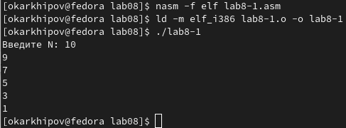{#fig:005 width=70%}

Для сохранения корректности работы программы с использованием регистра ecx в цикле нужен стек: ввожу команды push
и pop (добавления в стек и извлечения из стека) для сохранения значения счетчика цикла loop (рис. @fig:006).

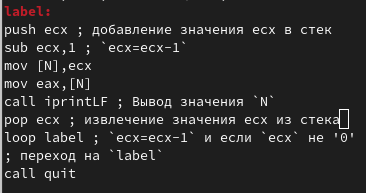{#fig:006 width=70%}

Проверяю работу программы, на этот раз результат корректен (рис. @fig:007).

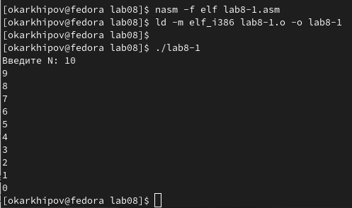{#fig:007 width=70%}


## Обработка аргументов командной строки

Создаю файл lab8-2.asm (рис. @fig:008).

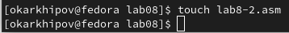{#fig:008 width=70%}

Ввожу текст программы обработки аргументов командной строки (рис. @fig:009).

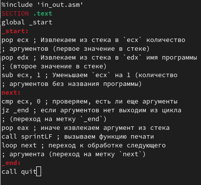{#fig:009 width=70%}

Создаю исполняемый файл и запускаю его с аргументами 9, 5, '3', т.е. программа обработала 3 аргумента, а также имя программы, итого 4 (рис. @fig:010).

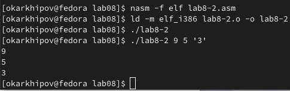{#fig:010 width=70%}

Создаю файл lab8-3.asm (рис. @fig:011).

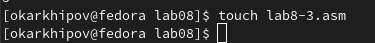{#fig:011 width=70%}

Пишу код программы которая выводит сумму чисел, которые передаются в программу как аргументы (рис. @fig:012).

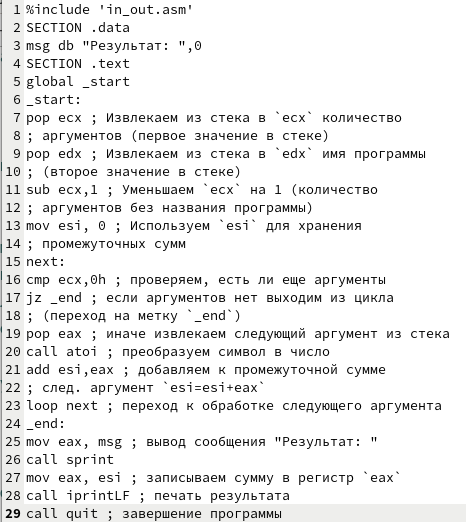{#fig:012 width=70%}

Далее создаю исполняемый файл с названием main и аргументами '12 13 7 10 5' и запускаю его (рис. @fig:013).

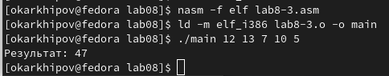{#fig:013 width=70%}

Меняю текст программы для вычисления произведения аргументов командной строки (рис. @fig:014). Для этого вместо 
``` NASM
mov esi, 0
``` 
пишу 
``` NASM
mov esi, 1
``` 
т.к. нейтральный элемент по умножению - единица, а также вместо
``` NASM
add esi,eax
```
пишу
``` NASM
mul esi
mov esi, eax 
```

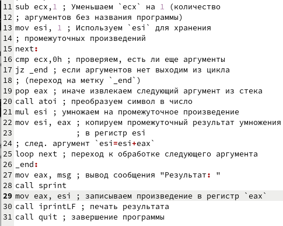{#fig:014 width=70%}

После исполнения обновленной программы получаю 54600 (рис. @fig:015).

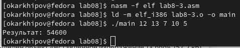{#fig:015 width=70%}

# Задание для самостоятельной работы

Создаю файл sol8.asm (рис. @fig:016).

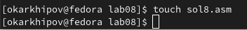{#fig:016 width=70%}

Беру тот же вариант, что был в двух предыдущих ЛР - 4. Код программы приведен в листинге ниже.


**Листинг программы для вычисления суммы значений функции**
``` NASM
%include 'in_out.asm'
SECTION .data
msg db "Результат: ",0
f db "Функция: f(x)=2(x-1)",0
SECTION .text
global _start
_start:
pop ecx   ; Извлекаем из стека в `ecx` количество
          ; аргументов (первое значение в стеке)
pop edx   ; Извлекаем из стека в `edx` имя программы
          ; (второе значение в стеке)
sub ecx,1 ; Уменьшаем `ecx` на 1 (количество
          ; аргументов без названия программы)
mov esi,0 ; Используем `esi` для хранения
          ; промежуточных сумм

next:
cmp ecx,0h ; проверяем, есть ли еще аргументы
jz _end    ; если аргументов нет выходим из цикла
           ; (переход на метку `_end`)
pop eax    ; иначе извлекаем следующий аргумент из стека
call atoi  ; преобразуем символ в число
sub eax, 1 ; eax=eax-1
mov edi, 2 ; edi=2
mul edi    ; eax=eax*edi
add esi, eax ; прибавляем к промежуточной сумме
loop next  ; переход к обработке следующего аргумента
_end:
mov eax, f  ; вывод сообщения "Функция: f(x)=2(x-1)"
call sprintLF
mov eax,msg ; вывод сообщения "Результат: " 
call sprint
mov eax, esi ; записываем сумму в регистр `eax`
call iprintLF ; печать результата
call quit  ; завершение программы
```

Проверяю работу программы с разными значениями x (рис. @fig:017).

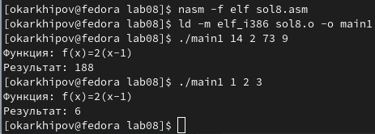{#fig:017 width=70%}

# Выводы

Была освоена работа со стеком, циклами и обработка аргументов командной строки, а также методы написания программ при помощи данных инструментов.

::: {#refs}
:::
