---
## Front matter
title: "РОССИЙСКИЙ УНИВЕРСИТЕТ ДРУЖБЫ НАРОДОВ"
subtitle: "Факультет физико-математических и естественных наук
Кафедра прикладной информатики и теории вероятностей"
author: "Архипов Олег Константинович"

## Generic otions
lang: ru-RU
toc-title: "Содержание"

## Bibliography
bibliography: bib/cite.bib
csl: pandoc/csl/gost-r-7-0-5-2008-numeric.csl

## Pdf output format
toc: true # Table of contents
toc-depth: 2
lof: true # List of figures
fontsize: 12pt
linestretch: 1.5
papersize: a4
documentclass: scrreprt
## I18n polyglossia
polyglossia-lang:
  name: russian
  options:
	- spelling=modern
	- babelshorthands=true
polyglossia-otherlangs:
  name: english
## I18n babel
babel-lang: russian
babel-otherlangs: english
## Fonts
mainfont: PT Serif
romanfont: PT Serif
sansfont: PT Sans
monofont: PT Mono
mainfontoptions: Ligatures=TeX
romanfontoptions: Ligatures=TeX
sansfontoptions: Ligatures=TeX,Scale=MatchLowercase
monofontoptions: Scale=MatchLowercase,Scale=0.9
## Biblatex
biblatex: true
biblio-style: "gost-numeric"
biblatexoptions:
  - parentracker=true
  - backend=biber
  - hyperref=auto
  - language=auto
  - autolang=other*
  - citestyle=gost-numeric
## Pandoc-crossref LaTeX customization
figureTitle: "Рис."
tableTitle: "Таблица"
listingTitle: "Листинг"
lofTitle: "Список иллюстраций"
lotTitle: "Список таблиц"
lolTitle: "Листинги"
## Misc options
indent: true
header-includes:
  - \usepackage{indentfirst}
  - \usepackage{float} # keep figures where there are in the text
  - \floatplacement{figure}{H} # keep figures where there are in the text
---

# Цель работы

Приобретение навыков написания программ с использованием подпрограмм. Знакомство
с методами отладки при помощи GDB и его основными возможностями.

# Выполнение лабораторной работы

## Реализация подпрограмм в NASM

Создаю каталог для ЛР9, а также файл lab09-1.asm (рис. @fig:001).

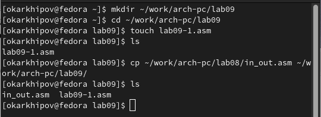{#fig:001 width=70%}

Ввожу программу ычисления арифметического выражения $𝑓(𝑥) = 2𝑥 + 7$ с помощью подпрограммы _calcul (рис. @fig:002).

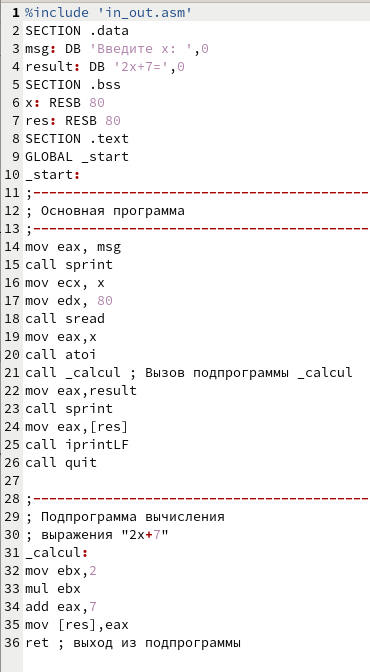{#fig:002 width=70%}

Создаю исполняемый файл и проверяю работу программы со значением х=5 (рис. @fig:003).

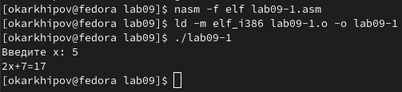{#fig:003 width=70%}

Изменяю текст программы, добавляя подпрограмму _subcalcul в подпрограмму _calcul,
для вычисления выражения $𝑓(𝑔(𝑥))$, где $x$ вводится с клавиатуры, $𝑓(𝑥) = 2𝑥 + 7$, $𝑔(𝑥) =
3𝑥 − 1$. Т.е. $𝑥$ передается в подпрограмму _calcul из нее в подпрограмму _subcalcul, где
вычисляется выражение $𝑔(𝑥)$, результат возвращается в _calcul и вычисляется выражение
$𝑓(𝑔(𝑥))$. Результат возвращается в основную программу для вывода результата на экран. Помимо этого добавляю сообщение, напоминающее о возникновении сложной функции (см. листинг ниже, ср. с рис. @fig:002).

**Листинг программы вычисления значения сложной функции**
``` NASM
%include 'in_out.asm'
SECTION .data
msg: DB 'Введите x: ',0
result: DB 'Результат: 2*g(x)+7=',0
ad: DB 'где g(x)=3x-1',0  ; новое выражение является сложной функцией
SECTION .bss
x: RESB 80
res: RESB 80
SECTION .text
GLOBAL _start
_start:
;------------------------------------------
; Основная программа
;------------------------------------------
mov eax, msg
call sprint
mov ecx, x
mov edx, 80
call sread
mov eax,x
call atoi
call _calcul ; Вызов подпрограммы _calcul
mov eax,result
call sprint
mov eax,[res]
call iprintLF
mov eax,ad
call sprintLF
call quit

;------------------------------------------
; Подпрограмма вычисления
; выражения "2x+7"
_calcul:
call _subcalcul ; Вызов подпрограммы _subcalcul
mov ebx,2
mul ebx
add eax,7
mov [res],eax
ret ; выход из подпрограммы

_subcalcul: ; подпрограмма подпрограммы
mov ebx,3  ; ebx=3
mul ebx    ; eax=eax*ebx
sub eax,1  ; eax=eax-1
ret        ; завершение _subcalcul
```

Проверяю результат (рис. @fig:004).

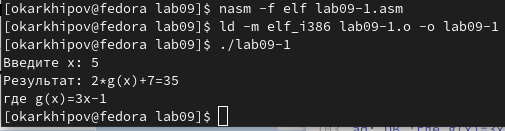{#fig:004 width=70%}

## Отладка программам с помощью GDB

Создаю файл lab09-2.asm (рис. @fig:005).

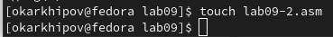{#fig:005 width=70%}

Ввожу код для вывода сообщения 'Hello world!' (рис. @fig:006).

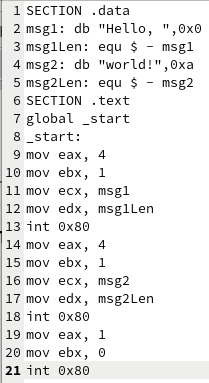{#fig:006 width=70%}

Создаю исполняемый файл lab09-2 (рис. @fig:007).

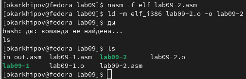{#fig:007 width=70%}

Провожу трансляцию с ключом '-g' , чтобы программу можно было отлаживать на уровне строк исходного кода (рис. @fig:008).

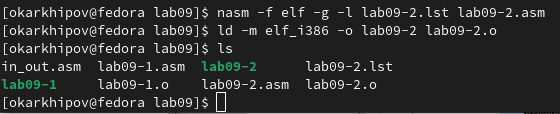{#fig:008 width=70%}

Загружаю исполняемый файл в отладчик. Выводится общая информация об отладчике и полезные ссылки (рис. @fig:009).

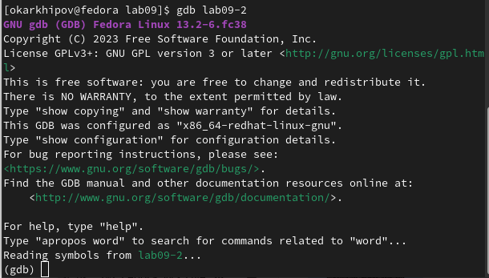{#fig:009 width=70%}

Проверяю работу программы, запустив ее в оболочке GDB с помощью команды r , подтверждаю начало сессии, нажав 'y'->'ENTER' (рис. @fig:010).

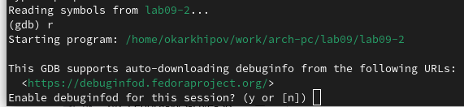{#fig:010 width=70%}

На экран выводится результат работы программы (рис. @fig:011).

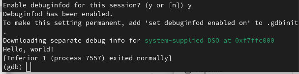{#fig:011 width=70%}

Устанавливаю брейкпоинт на метку _start, с которой начинается выполнение любой ассемблерной программы, после чего запускаю программу. Появляется краткая информация о точке останова и строке, следующей за _start (рис. @fig:012).

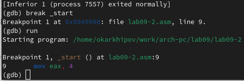{#fig:012 width=70%}

Ввожу команду disassemble _start , чтобы посмотреть дизассемблированный код программы (рис. @fig:013).

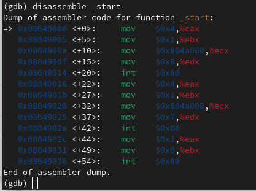{#fig:013 width=70%}

Переключаюсь на отображение команд с Intel’овским синтаксисом:
``` NASM
(gdb) set disassembly-flavor intel
(gdb) disassemble _start
```
Можно сравнить рис. @fig:013 и рис. @fig:014. В последней колонке режима ATT сначала указан адрес второго операнда, а затем со знаком '%' - первый. Синтаксис Intel больше похож на исходный код, как он вводится в текстовый редактор: сохранен порядок адресов операндов и нет '%'.

{#fig:014 width=70%}

Ввожу команды для перехода в режим псевдографики. Как видим, значения регистров недоступны (рис. @fig:015), так что снова ввожу команду run , после чего значения регистров появляются в верхней секции (рис. @fig:016).
``` NASM
(gdb) layout asm
(gdb) layout regs
```

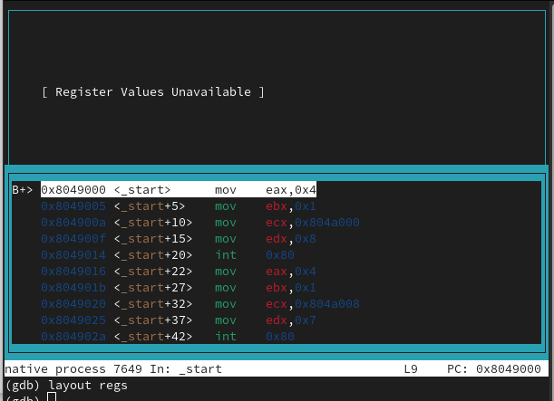{#fig:015 width=70%}

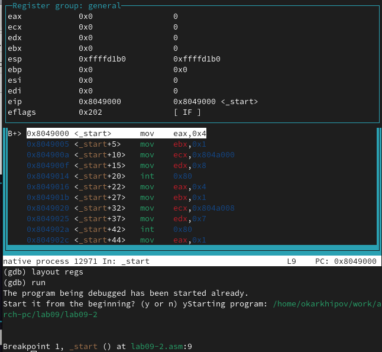{#fig:016 width=70%}

Проверяю наличие введенной ранее точки останова (рис. @fig:017).

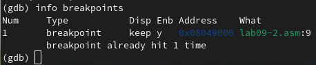{#fig:017 width=70%}

Создаю новую точку останова по адресу предпоследней инструкции (mov ebx,0x0) и проверяю, какие точки останова созданы (рис. @fig:018).

{#fig:018 width=70%}

C помощью команды stepi (или si) выполняю 5 инструкций (рис. @fig:019-@fig:024). Как видим, на каждом шаге измененные регистры выделены белым: 2 раза eax, ebx, 3 раза eip , ecx , edx .

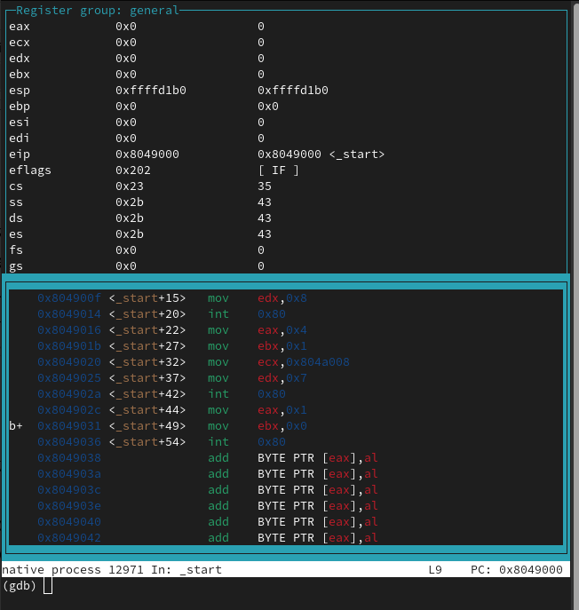{#fig:019 width=70%}

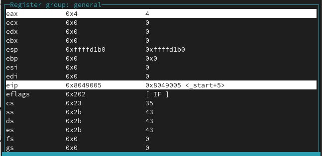{#fig:020 width=70%}

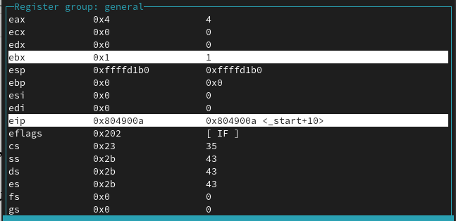{#fig:021 width=70%}

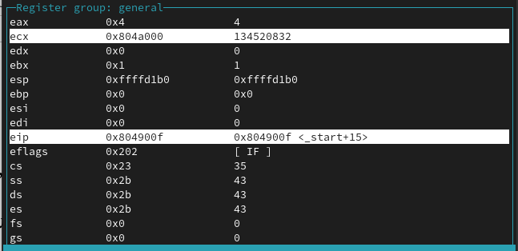{#fig:022 width=70%}

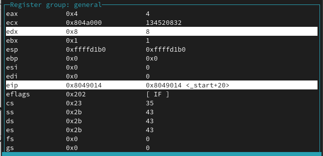{#fig:023 width=70%}

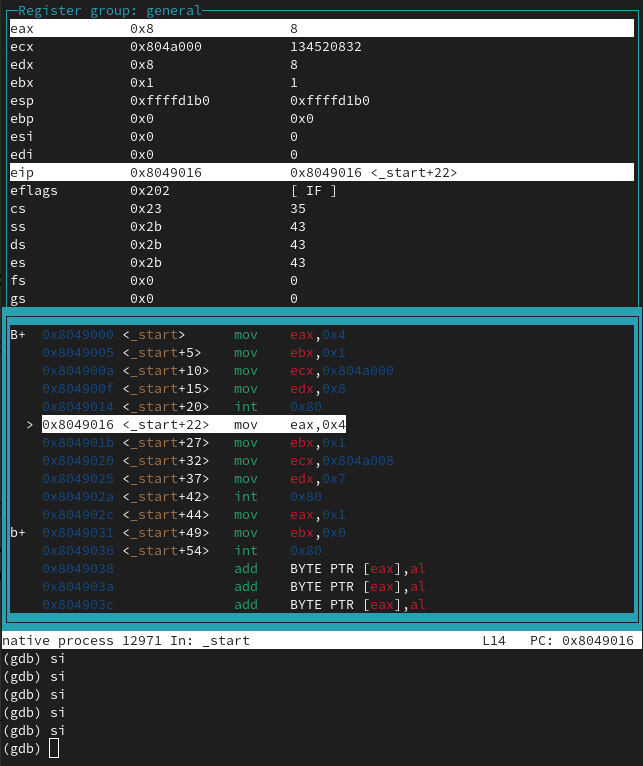{#fig:024 width=70%}

Далее ввожу команду i r , чтобы просмотреть содержимое регистров другим способом (рис. @fig:025).

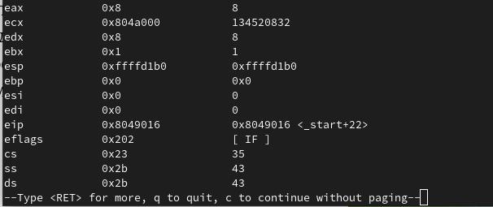{#fig:025 width=70%}

Смотрю значение переменной msg1 по имени (рис. @fig:026).

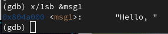{#fig:026 width=70%}

Смотрю значение переменной msg2 по адресу, определяя его по дизассемблированной инструкции mov ecx,msg2 (рис. @fig:027).

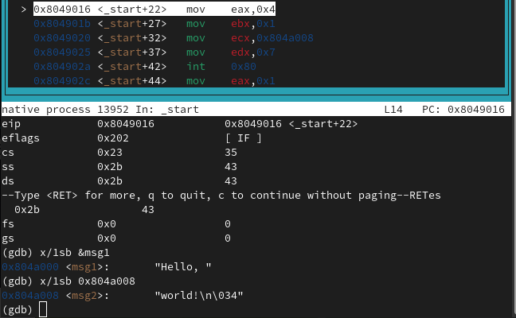{#fig:027 width=70%} 

Заменяю первый и второй символы переменной msg1 (рис. @fig:028).

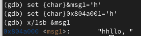{#fig:028 width=70%}

Заменяю третий символ переменной msg2 ('r' на 'w') (рис. @fig:029).

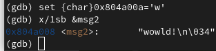{#fig:029 width=70%}

Вывожу в различных форматах значение регистра edx (p/x и p/a - символьный, p/t - двоичный, p/s - шестнадцатиричный) (рис. @fig:030-@fig:031).

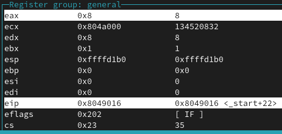{#fig:030 width=70%}

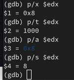{#fig:031 width=70%}

С помощью команды set изменяю значение регистра ebx (рис. @fig:032). Результаты различны из-за того, что в первом случае значение ebx было заменено на символ '2', код которого в ASCII равен 50, во втором случае значение ebx заменяется на код.

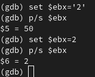{#fig:032 width=70%}

Завершаю выполнение программы при помощи continue и выхожу при помощи q (рис. @fig:033).

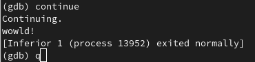{#fig:033 width=70%}

## Обработка аргументов командной строки в GDB

Копирую файл lab8-2.asm в lab09 с именем lab09-3.asm , создаю исполняемый файл (рис. @fig:034).

{#fig:034 width=70%}

Используя ключ --args , загружаю программу в gdb с аргументами (рис. @fig:035).

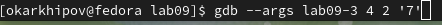{#fig:035 width=70%}

Для исследования расположения аргументов командной строки в стеке после запуска программы с помощью gdb устанавливаю точку останова перед первой инструкцией в программе и запускаю ее (рис. @fig:036).
``` NASM
(gdb) b _start
(gdb) run
```
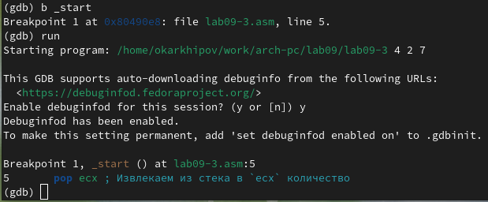{#fig:036 width=70%}

Вывожу адрес вершины стека, где располагается число равное количеству аргументов командной строки (включая имя программы), их 4 (рис. @fig:037).

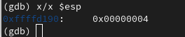{#fig:037 width=70%}

Просматриваю остальные позиции стека – по адресу [esp+4] располагается адрес в памяти, где находится имя программы, по адресу [esp+8] хранится адрес первого аргумента, по адресу [esp+12] – второго, по адресу [esp+16] - третьего (рис. @fig:038). Шаг изменения равен 4, т.к. данные аргументы смещены относительно вершины стека на 4, 8 и т.д. байта.

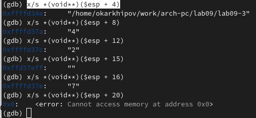{#fig:038 width=70%}

# Самостоятельная работа

## Преобразуйте программу из лабораторной работы №8

Копирую файл самостоятельной работы из ЛР8 с новым именем (рис. @fig:039).

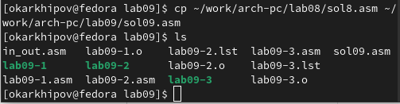{#fig:039 width=70%}

Редактирую код так, чтобы вычисление значений $f(x)$ стало подпрограммой (рис. @fig:040).

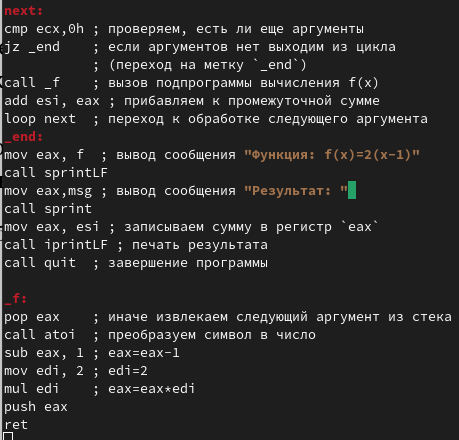{#fig:040 width=70%}

Проверка корректности работы измененного кода (рис. @fig:041).

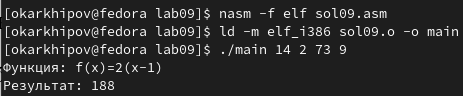{#fig:041 width=70%}

## Проверка программы при помощи отладчика

Создаю файл sol09-2.asm и ввожу код из листинга для вычисления выражения $(3 + 2) ∗ 4 + 5$ (рис. @fig:042-@fig:043).

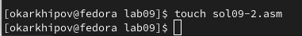{#fig:042 width=70%} 

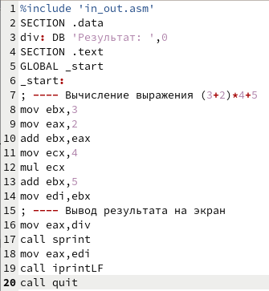{#fig:043 width=70%} 

Проверка показывает ошибочный ответ (рис. @fig:044).

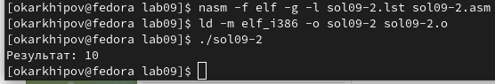{#fig:044 width=70%}

Запускаю sol09-2 в gdb , ставлю точку останова на _start , т.к. ошибка, очевидно, в теле программы и дизассемблирую ее при помощи синтаксиса Intel (рис. @fig:045).

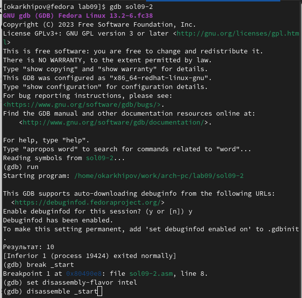{#fig:045 width=70%} 

Включаю режим псевдографики (рис. @fig:046).

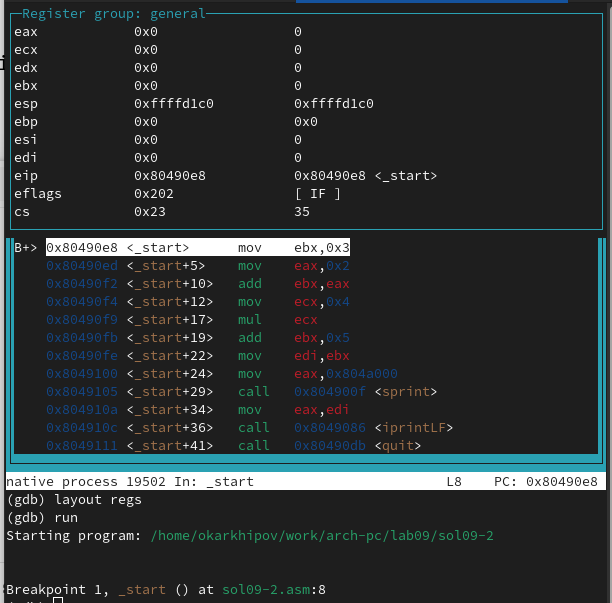{#fig:046 width=70%}

Установлю точки останова после каждого действия (рис. @fig:047). Буду проверять значения регистров eax , ebx , ecx на каждом шаге, т.к. они участвуют в вычислении значения выражения.

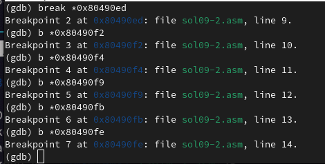{#fig:047 width=70%}

Запуcтив программу, и введя команды
``` NASM
(gdp) p/d $eax
$1=0
(gdp) p/d $ebx
$2=0
(gdp) p/d $ecx
$3=0
```
где d отвечает за отображение результатов в десятичном формате, получаю пока значения во всех 3-х регистрах, равные нулю (рис. @fig:048).

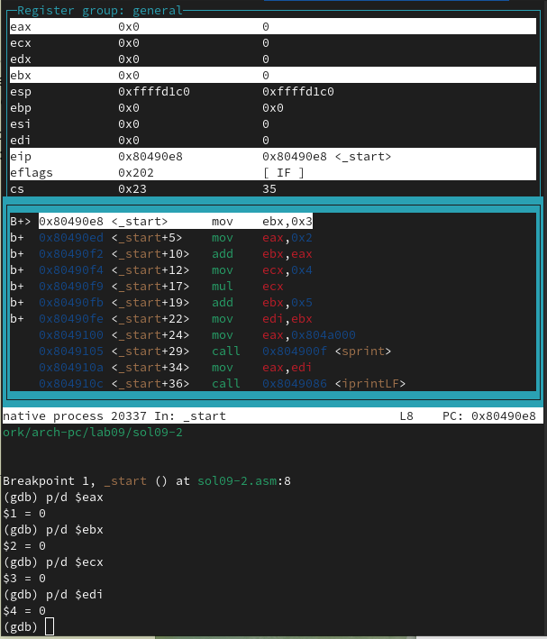{#fig:048 width=70%}

Далее проматываю программу до следующей точки останова (на 1 строку) при помощи c . В верхней секции вижу, что из интересующих меня изменился только регистр ebx , он стал равен 3 (рис. @fig:049).

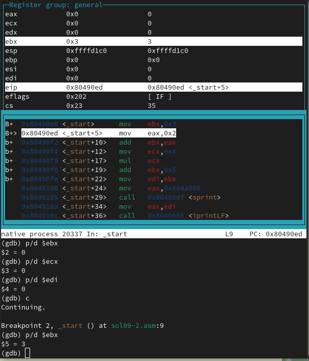{#fig:049 width=70%}

Так же проматываю далее. Изменился eax , ему присвоено значение 2 (рис. @fig:050).

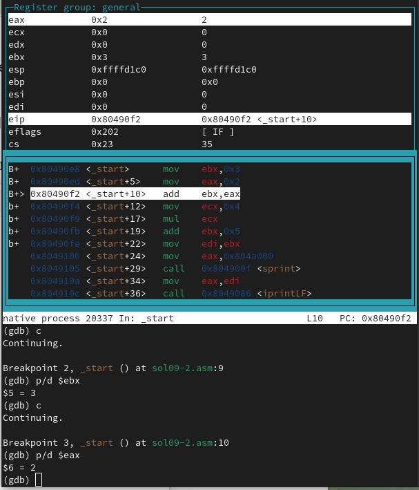{#fig:050 width=70%} 

Теперь эти два числа нужно сложить, за что отвечает следующая строка. Операция выполнена верно (получено число 5), и результат записан в регистр ebx (рис. @fig:051).

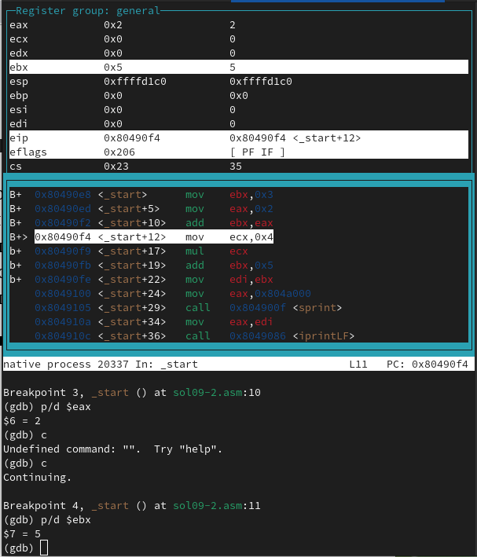{#fig:051 width=70%} 

Далее в регистр ecx было записано число 4 (рис. @fig:052).

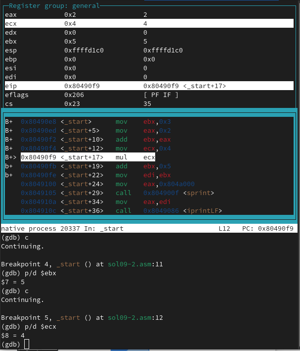{#fig:052 width=70%} 

Перехожу к следующему действию. Теперь в регистре eax стоит число 8 (рис. @fig:053). Что является результатом операции 'eax=eax*ecx=2*4' , это неверно, т.к. необходима операция 'eax=ebx*ecx=5*4=20' из-за того что результат первого действия был записан в регистр ebx , однако когда размер операндов 4 байта один из сомножителей всегда берется из регистра eax и записывается в него же. Итак, необходимо записать результат первого сложения в регистр eax .

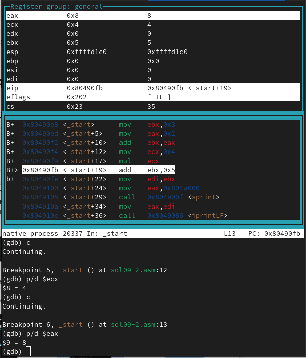{#fig:053 width=70%} 

На всякий случай продолжу проверку. После перехода к следующему шагу получаю 'ebx=ebx+5=10'. Это итоговый ответ, и он неверный, т.к. в регистре ebx по сказанному выше не учитывается результат умножения (рис. @fig:054).

{#fig:054 width=70%} 

Итак, чтобы программа работала корректно, нужно записать результат первого и последнего действий в регистр 'eax' вместо 'ebx' , а также поменять первое слогаемое в последнем действии на eax . Кроме того, т.к. для записи итогового значения используется регистр eax , то в edi нужно поместить значение eax

Выхожу из отладчика и исправляю код (рис. @fig:055).

{#fig:055 width=70%}

Сохраняю изменения, выхожу из редактора, создаю исполняемый файл и запускаю его (рис. @fig:056-@fig:057).

{#fig:056 width=70%}

{#fig:057 width=70%}

Получаю верно работающую программу. Хууух

# Выводы

Освоены навыки написания программ при помощи подпрограмм и методы отладки при помощи gdb.

# Список литературы{.unnumbered}

::: {#refs}
:::
