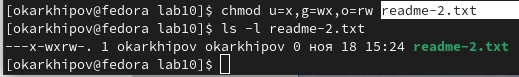

---
## Front matter
title: "РОССИЙСКИЙ УНИВЕРСИТЕТ ДРУЖБЫ НАРОДОВ"
subtitle: "Факультет физико-математических и естественных наук
Кафедра прикладной информатики и теории вероятностей"
author: "Архипов Олег Константинович"

## Generic otions
lang: ru-RU
toc-title: "Содержание"

## Bibliography
bibliography: bib/cite.bib
csl: pandoc/csl/gost-r-7-0-5-2008-numeric.csl

## Pdf output format
toc: true # Table of contents
toc-depth: 2
lof: true # List of figures
fontsize: 12pt
linestretch: 1.5
papersize: a4
documentclass: scrreprt
## I18n polyglossia
polyglossia-lang:
  name: russian
  options:
	- spelling=modern
	- babelshorthands=true
polyglossia-otherlangs:
  name: english
## I18n babel
babel-lang: russian
babel-otherlangs: english
## Fonts
mainfont: PT Serif
romanfont: PT Serif
sansfont: PT Sans
monofont: PT Mono
mainfontoptions: Ligatures=TeX
romanfontoptions: Ligatures=TeX
sansfontoptions: Ligatures=TeX,Scale=MatchLowercase
monofontoptions: Scale=MatchLowercase,Scale=0.9
## Biblatex
biblatex: true
biblio-style: "gost-numeric"
biblatexoptions:
  - parentracker=true
  - backend=biber
  - hyperref=auto
  - language=auto
  - autolang=other*
  - citestyle=gost-numeric
## Pandoc-crossref LaTeX customization
figureTitle: "Рис."
tableTitle: "Таблица"
listingTitle: "Листинг"
lofTitle: "Список иллюстраций"
lotTitle: "Список таблиц"
lolTitle: "Листинги"
## Misc options
indent: true
header-includes:
  - \usepackage{indentfirst}
  - \usepackage{float} # keep figures where there are in the text
  - \floatplacement{figure}{H} # keep figures where there are in the text
---

# Цель работы

Приобретение навыков написания программ для работы с файлами.

# Выполнение лабораторной работы

Создаю каталог для программ ЛР10, перехожу в него и создаю там 3 файла (рис. @fig:001).

{#fig:001 width=70%}


{#fig:002 width=70%}

Ввожу в файл lab10-1.asm текст программы (рис. @fig:002).

Создаю ещё один файл readme.asm , после чего запускаю процессы трансляции и компановки, получаю исполнительный файл main , запускаю его, на запрос ввода строки пишу 'Hello world!' , затем, при помощи команды 'ls -l' проверяю содержимое папки lab10 , а командой 'cat readme.txt' вывожу на экран содержимое файла readme.txt (рис. @fig:003).

{#fig:003 width=70%}

После этого переименовываю исполняемый файл main в lab10-1 и снова проверяю содержимое папки (рис. @fig:004).

{#fig:004 width=70%}

Изменяю права доступа к файлу lab10-1 , запрещая его выполнение для всех видов пользователей (опция a-x). Попытка запуска не удается, т.к. только что я запретил данный процесс всем, включая себя (рис. @fig:005).

{#fig:005 width=70%}

Теперь предоставлю всем пользователям право запускать файл lab10-1.asm и попробую его выполнить, получаю отчет о синтаксической ошибке, связанной с наличием комментария в начале исходного текста программы (рис. @fig:006). Удаляю этот комментарий (рис. @fig:007), проверяю, как изменились права доступа (рис. @fig:008) и пробую запустить еще раз, но снова получаю ошибку (рис. @fig:009), т.к. файлы asm написаны не на языке программирования, а потому процессор не может распознать заложенные в программе команды без процедуры трансляции. 

{#fig:006 width=70%}

{#fig:007 width=70%}

{#fig:008 width=70%}

{#fig:009 width=70%}

Теперь необходимо в соответствии с моим вариантом в прошлых ЛР предоставить права доступа к файлу readme-
1.txt представленные в символьном виде, а для файла readme-2.txt – в двочном виде (рис. @fig:010).

{#fig:010 width=70%}

Делаю это как показано на рис. @fig:011: 'u=w' предоставляет владельцу право записи, 'g=-' - группу владельца лишает всех прав, а '0=w' дает всем остальным пользователям также право записи, затем проверяю результат командой 'ls -l' .

{#fig:011 width=70%}

Чтобы изменить права доступа в соответствии с двоичным представлением вспомню, что 1 означает наличие одной из букв r , w , x , а 0 соответствует '-', т.е. отсутствию доступа. Руководствуясь этим знанием, введу команду
``` NASM
chmod u=x,g=wx,o=rw readme-2.txt
```
и для проверки правильности 
``` NASM
ls -l readme-2.txt
```
Результат можно увидеть на рис. @fig:012.

{#fig:012 width=70%}

# Задание для самостоятельной работы
Написать программу работающую по следующему алгоритму:

* Вывод приглашения “Как Вас зовут?”
* Ввести с клавиатуры свои фамилию и имя
* Создать файл с именем name.txt
* Записать в файл сообщение “Меня зовут”
* Дописать в файл строку введенную с клавиатуры
* Закрыть файл

Создаю файл для самостоятельной работы (рис. @fig:013).

{#fig:013 width=70%}

Ввожу в новый файл следующий код:

``` NASM
%include 'in_out.asm'
SECTION .data
filename db 'name.txt',0h   ; имя файла
msg1 db 'Как Вас зовут? ',0h ; сообщение 1
msg2 db 'Меня зовут ',0h     ; сообщение 2
SECTION .bss
cont resb 255       ; переменная для вводимой строки
SECTION .text
global _start
_start:
mov eax, msg1
call sprint   ; вывод сообщения msg1
mov ecx,cont

mov ecx, cont
mov edx, 255
call sread    ; запись введенной с клавиатуры строки

; создание файла name.txt (sys_creat)
mov ecx, 0777o ; установка прав доступа
mov ebx, filename ; имя созданного файла
mov eax, 8     ; код системного вызова creat
int 80h

; запись дискриптора файла в 'esi'
mov esi, eax

; расчет длины msg2
mov eax, msg2
call slen
mov edi, eax ; запись длины в 'edi'

; запись в файл сообщения msg2 (sys_write)
mov edx, edi  ; запись длины msg2 в байтах
mov ecx, msg2 ; сообщение
mov ebx, esi  ; дискриптор
mov eax, 4    ; код системного вызова
int 80h

; расчет длины введенной строки
mov eax, cont
call slen

; запись в файл введенной строки (sys_write)
mov edx, eax    ; запись длины cont в байтах
mov ecx, cont   ; сообщение
mov ebx, esi    ; дискриптор
mov eax, 4      ; код системного вызова
int 80h

; закрыть файл (sys_close)
mov ebx, esi    ; дискриптор
mov eax, 6      ; код системного вызова
int 80h

call quit
```

Создаю исполняемый файл, запускаю его, ввожу свои фамилию и имя (рис. @fig:014).

{#fig:014 width=70%}

Далее командой 'ls -l' проверяю создавшиеся файлы: 'name.txt' , 'sol10.lst' , 'sol10.o' , 'sol10' . И наконец, командой 'cat name.txt' считываю содержимое файла 'name.txt' (рис. @fig:015). Делаю вывод, что код был корректен.

{#fig:015 width=70%}

# Выводы

Были приобретены навыки работы с файлами при помощи NASM.

# Список литературы{.unnumbered}

::: {#refs}
:::
